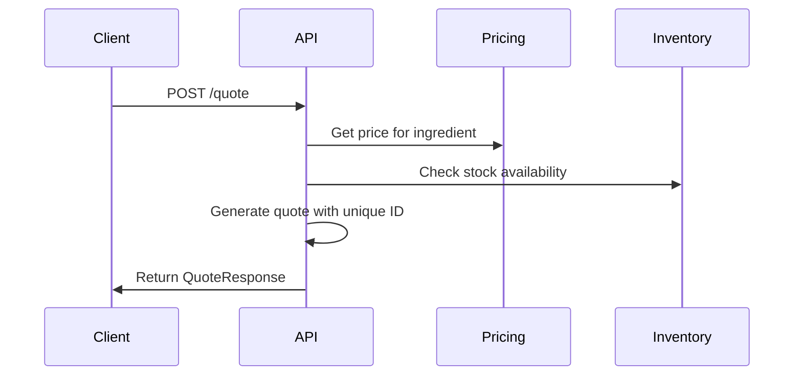
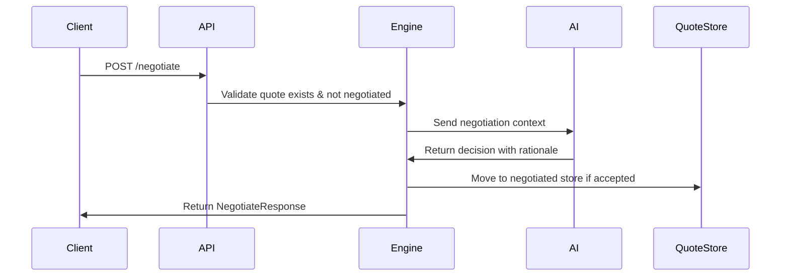
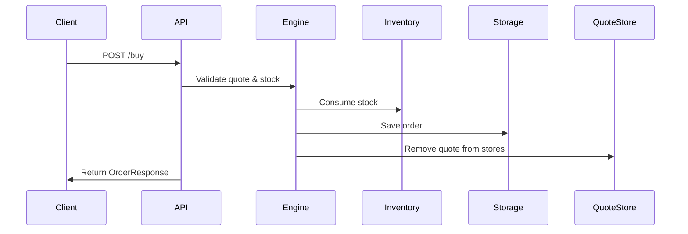

# Coffee Empire - Price Negotiation API

This document provides a comprehensive guide for using the price negotiation feature in the Coffee Empire API. The negotiation system allows customers to request price adjustments for quotes using natural language explanations, with an AI-powered decision engine.

## Table of Contents

- [Overview](#overview)
- [API Endpoints](#api-endpoints)
- [Workflow](#workflow)
- [Request/Response Models](#requestresponse-models)
- [Error Handling](#error-handling)
- [Examples](#examples)
- [Business Rules](#business-rules)
- [Integration Guide](#integration-guide)

## Overview

The negotiation system enables customers to:
1. **Request a quote** for ingredients
2. **Negotiate the price** by providing a proposed price and business rationale
3. **Receive AI-powered decisions** on whether the negotiation is accepted
4. **Use negotiated quotes** for purchasing (with re-negotiation prevention)

### Key Features

- **One-time negotiation**: Each quote can only be negotiated once
- **AI-powered decisions**: Uses OpenAI GPT-4 with structured outputs for intelligent pricing decisions
- **Fallback logic**: Rule-based negotiation when AI is unavailable
- **Audit trail**: Complete tracking of negotiation decisions and rationale
- **Quote lifecycle management**: Automatic cleanup and expiration handling

## API Endpoints

### 1. Get Quote
```http
POST /quote
```

**Request:**
```json
{
  "ingredient_id": "DARK-ROAST-BEANS-STD-KG",
  "quantity": 25.0
}
```

**Response:**
```json
{
  "quote_id": "550e8400-e29b-41d4-a716-446655440000",
  "ingredient_id": "DARK-ROAST-BEANS-STD-KG",
  "name": "Dark Roast Coffee Beans",
  "description": "Premium dark roast coffee beans",
  "unit_of_measure": "kg",
  "price_per_unit": 17.50,
  "total_price": 437.50,
  "currency": "USD",
  "available_stock": 100.0,
  "delivery_time": 86400,
  "use_by_date": 1735689600,
  "price_valid_until": 1735603200
}
```

### 2. Negotiate Price
```http
POST /negotiate
```

**Request:**
```json
{
  "quote_id": "550e8400-e29b-41d4-a716-446655440000",
  "proposed_price_per_unit": 15.75,
  "rationale": "We are a regular customer and would like to establish a long-term relationship. We can commit to bulk orders in the future."
}
```

**Response:**
```json
{
  "original_quote": {
    "quote_id": "550e8400-e29b-41d4-a716-446655440000",
    "ingredient_id": "DARK-ROAST-BEANS-STD-KG",
    "name": "Dark Roast Coffee Beans",
    "description": "Premium dark roast coffee beans",
    "unit_of_measure": "kg",
    "price_per_unit": 17.50,
    "total_price": 437.50,
    "currency": "USD",
    "available_stock": 100.0,
    "delivery_time": 86400,
    "use_by_date": 1735689600,
    "price_valid_until": 1735603200
  },
  "proposed_price_per_unit": 15.75,
  "final_price_per_unit": 15.75,
  "accepted": true,
  "llm_rationale": "Accepted: Price adjustment within acceptable range; Customer relationship factors considered",
  "new_quote": {
    "quote_id": "550e8400-e29b-41d4-a716-446655440000",
    "ingredient_id": "DARK-ROAST-BEANS-STD-KG",
    "name": "Dark Roast Coffee Beans",
    "description": "Premium dark roast coffee beans",
    "unit_of_measure": "kg",
    "price_per_unit": 15.75,
    "total_price": 393.75,
    "currency": "USD",
    "available_stock": 100.0,
    "delivery_time": 86400,
    "use_by_date": 1735689600,
    "price_valid_until": 1735603200
  }
}
```

### 3. Purchase with Quote
```http
POST /buy
```

**Request:**
```json
{
  "quote_id": "550e8400-e29b-41d4-a716-446655440000",
  "ingredient_id": "DARK-ROAST-BEANS-STD-KG",
  "quantity": 25.0,
  "business_id": "business-123"
}
```

**Response:**
```json
{
  "order_id": "660e8400-e29b-41d4-a716-446655440001",
  "business_id": "business-123",
  "items": {
    "DARK-ROAST-BEANS-STD-KG": {
      "ingredient_id": "DARK-ROAST-BEANS-STD-KG",
      "quantity": 25.0,
      "price_per_unit_paid": 15.75,
      "total_price": 393.75,
      "use_by_date": 1735689600
    }
  },
  "total_cost": 393.75,
  "order_placed_at": 1735516800,
  "expected_delivery": 1735603200,
  "status": "CONFIRMED",
  "quote_id": "550e8400-e29b-41d4-a716-446655440000"
}
```

## Workflow

### 1. Quote Request


### 2. Negotiation Process


### 3. Purchase Process


## Request/Response Models

### NegotiateRequest
```typescript
{
  quote_id: string;                    // Required: Valid quote ID
  proposed_price_per_unit: number;     // Required: Must be > 0
  rationale: string;                   // Required: 1-1000 characters
}
```

### NegotiateResponse
```typescript
{
  original_quote: QuoteResponse;       // The original quote details
  proposed_price_per_unit: number;     // What customer proposed
  final_price_per_unit: number;        // Final agreed price
  accepted: boolean;                   // Whether negotiation was accepted
  llm_rationale: string;               // AI explanation of decision
  new_quote?: QuoteResponse;           // Updated quote (if accepted)
}
```

### QuoteResponse
```typescript
{
  quote_id: string;                    // Unique quote identifier
  ingredient_id: string;               // Ingredient being quoted
  name: string;                        // Human-readable name
  description: string;                 // Detailed description
  unit_of_measure: string;             // Unit (kg, lb, etc.)
  price_per_unit: number;              // Price per unit
  total_price: number;                 // Total for requested quantity
  currency: string;                    // Currency code
  available_stock: number;             // Current stock level
  delivery_time: number;               // Delivery time in seconds
  use_by_date: number;                 // Expiry timestamp
  price_valid_until: number;           // Quote expiry timestamp
}
```

## Error Handling

### HTTP Status Codes

| Code | Meaning | Description |
|------|---------|-------------|
| 200 | Success | Negotiation completed successfully |
| 400 | Bad Request | Invalid negotiation request |
| 404 | Not Found | Quote not found |
| 422 | Validation Error | Invalid request format |

### Error Responses

#### Quote Not Found
```json
{
  "detail": "Quote not found. You need a valid unnegotiated quote before you can negotiate."
}
```

#### Quote Already Negotiated
```json
{
  "detail": "This quote has already been negotiated. You cannot re-negotiate a negotiated quote."
}
```

#### Quote Expired
```json
{
  "detail": "Quote has expired. Please request a new quote before negotiating."
}
```

#### Invalid Price Request
```json
{
  "detail": "You are trying to ask for a higher price per unit ?!"
}
```

#### Validation Error
```json
{
  "detail": [
    {
      "loc": ["body", "proposed_price_per_unit"],
      "msg": "ensure this value is greater than 0",
      "type": "value_error.number.not_gt"
    }
  ]
}
```

## Examples

### Example 1: Successful Negotiation

**Step 1: Get Quote**
```bash
curl -X POST "http://localhost:8080/quote" \
  -H "Content-Type: application/json" \
  -d '{
    "ingredient_id": "DARK-ROAST-BEANS-STD-KG",
    "quantity": 50.0
  }'
```

**Step 2: Negotiate Price**
```bash
curl -X POST "http://localhost:8080/negotiate" \
  -H "Content-Type: application/json" \
  -d '{
    "quote_id": "550e8400-e29b-41d4-a716-446655440000",
    "proposed_price_per_unit": 16.00,
    "rationale": "We are a large coffee chain and can commit to monthly orders of 500kg. This would be a significant long-term partnership."
  }'
```

**Step 3: Purchase**
```bash
curl -X POST "http://localhost:8080/buy" \
  -H "Content-Type: application/json" \
  -d '{
    "quote_id": "550e8400-e29b-41d4-a716-446655440000",
    "ingredient_id": "DARK-ROAST-BEANS-STD-KG",
    "quantity": 50.0,
    "business_id": "coffee-chain-123"
  }'
```

### Example 2: Failed Negotiation

```bash
curl -X POST "http://localhost:8080/negotiate" \
  -H "Content-Type: application/json" \
  -d '{
    "quote_id": "550e8400-e29b-41d4-a716-446655440000",
    "proposed_price_per_unit": 10.00,
    "rationale": "This is too expensive"
  }'
```

**Response:**
```json
{
  "original_quote": { /* ... */ },
  "proposed_price_per_unit": 10.00,
  "final_price_per_unit": 17.50,
  "accepted": false,
  "llm_rationale": "Rejected: Proposed price 10.0 is below base price 15.0; Requested discount of 42.9% is too large",
  "new_quote": null
}
```

### Example 3: Re-negotiation Attempt

```bash
curl -X POST "http://localhost:8080/negotiate" \
  -H "Content-Type: application/json" \
  -d '{
    "quote_id": "550e8400-e29b-41d4-a716-446655440000",
    "proposed_price_per_unit": 15.00,
    "rationale": "Can we get an even better deal?"
  }'
```

**Response:**
```json
{
  "detail": "This quote has already been negotiated. You cannot re-negotiate a negotiated quote."
}
```

## Business Rules

### AI Decision Factors

The AI considers multiple factors when making negotiation decisions:

1. **Price Difference**: Percentage difference between proposed and current price
2. **Base Price Protection**: Never accept prices below the ingredient's base cost
3. **Customer Relationship**: Keywords like "bulk", "regular", "loyal", "long-term"
4. **Stock Levels**: Low stock may affect pricing decisions
5. **Market Conditions**: Current demand and supply factors

### Fallback Rules (When AI Unavailable)

- **Accept**: Proposed price within 10% of current price AND above base price
- **Reject**: All other cases
- **Rationale**: Clear explanation of decision

### Quote Lifecycle Rules

1. **Creation**: Quote stored in regular quote store
2. **First Negotiation**:
   - ✅ **Accepted** → Moved to negotiated store (cannot re-negotiate)
   - ❌ **Rejected** → Stays in regular store (can still purchase)
3. **Re-negotiation**: Rejected with error message
4. **Purchase**: Quote removed from both stores
5. **Expiration**: Automatic cleanup of expired quotes
